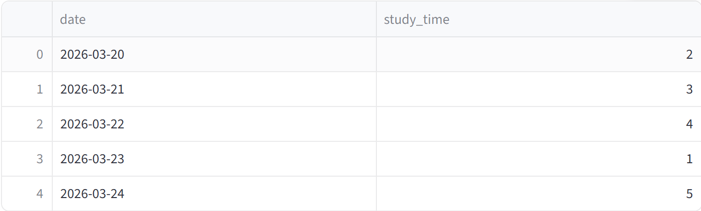
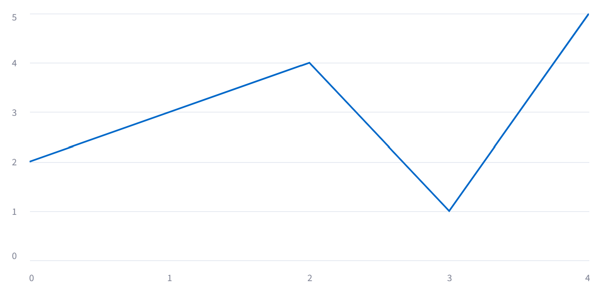

#   CSV分析アプリ

##   概要
PythonとStreamlitを使用して作成したCSV分析アプリです。csvファイルを読み込み、データの表示、統計情報の確認、グラフによる可視化を簡単に行うことができます。

##   作成目的
データ分析の基礎である「データの読み込み・集計・可視化」を実践的に学ぶために作成しました。また、Python(pandas)を用いたデータ処理と、Streamlitによるアプリ化のスキル習得を目的としています。

---
##   画面

###   データ表示


###   グラフ表示

---

##   主な機能
- csvファイルのアップロード
- データの表示(表形式)
- 列ごとの統計情報表示(平均・最大・最小など)
- グラフ表示(棒グラフ・折れ線など)
- インタラクティブに列選択が可能

---
##   実行方法

```bash
git clone https://github.com/uchiyama_codes/csv-analysis-app.git
cd csv-analysis-app
pip install -r requirements.txt
streamlit run app.py
```

---

